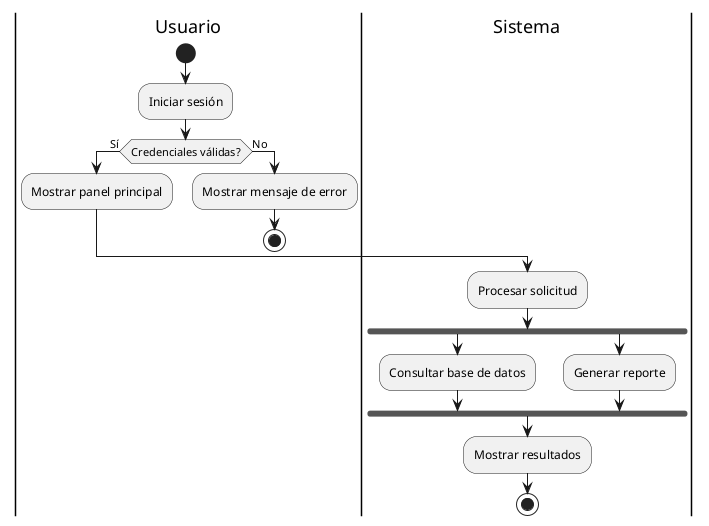

# Documentación: Diagrama de Actividades UML

## Concepto

El **Diagrama de Actividades** en UML es un diagrama **comportamental** que representa el **flujo de trabajo** o **procesos** dentro de un sistema. Se centra en las actividades (acciones o pasos) que deben ejecutarse y en el orden en que ocurren, mostrando además las condiciones, decisiones y concurrencias que afectan dicho flujo.

Se utiliza para describir **procesos de negocio**, **flujos de casos de uso** o **algoritmos complejos**, brindando una vista clara de cómo se ejecutan las tareas de inicio a fin.

---

## Objetivos

- Modelar el **flujo de control** y de **datos** en un proceso.
- Representar la **lógica de negocio** o **flujo de actividades** de un caso de uso.
- Identificar **puntos de decisión**, **paralelismo** y **sincronización** en procesos.
- Facilitar la comprensión de procesos **complejos** mediante una representación visual.

---

## Elementos Principales

1. **Actividad (Activity):**  
   Representa una acción o tarea a realizar. Se muestra como un rectángulo redondeado.

2. **Nodo Inicial:**  
   Punto de inicio del flujo. Se representa como un **círculo sólido**.

3. **Nodo Final de Flujo:**  
   Indica el fin de una secuencia de actividades, pero no necesariamente el final del proceso. Representado por un **círculo con borde grueso**.

4. **Nodo Final de Actividad:**  
   Señala el fin de toda la actividad. Representado por un **círculo sólido rodeado por un círculo**.

5. **Transición / Flujo de Control:**  
   Flechas que conectan actividades y muestran el orden de ejecución.

6. **Decisión (Decision Node):**  
   Representa una bifurcación en el flujo (condicional). Se dibuja como un **rombo** con salidas etiquetadas con condiciones.

7. **Fusión (Merge Node):**  
   Une múltiples flujos en un único camino. Se representa con un **rombo**.

8. **Fork (División):**  
   Divide un flujo en varios paralelos. Representado con una **línea gruesa horizontal o vertical**.

9. **Join (Unión):**  
   Sincroniza flujos paralelos en uno solo. También representado por una **línea gruesa**.

10. **Swimlanes (Carriles):**  
    Dividen el diagrama para indicar **responsabilidades** o **roles** dentro del proceso. Cada carril agrupa actividades de un actor o componente.

11. **Objeto / Datos:**  
    Representa un dato que se usa o produce en una actividad. Se dibuja como un **rectángulo** conectado con líneas punteadas.

---

## Ventajas

- Facilita la comprensión del **flujo de procesos complejos**.  
- Permite identificar **condiciones críticas**, **errores lógicos** o pasos innecesarios.  
- Útil en **análisis de negocio** y **diseño de software**.  
- Integra conceptos de **flujo de trabajo** y **paralelismo**.  

---

## Ejemplo (PlantUML)

