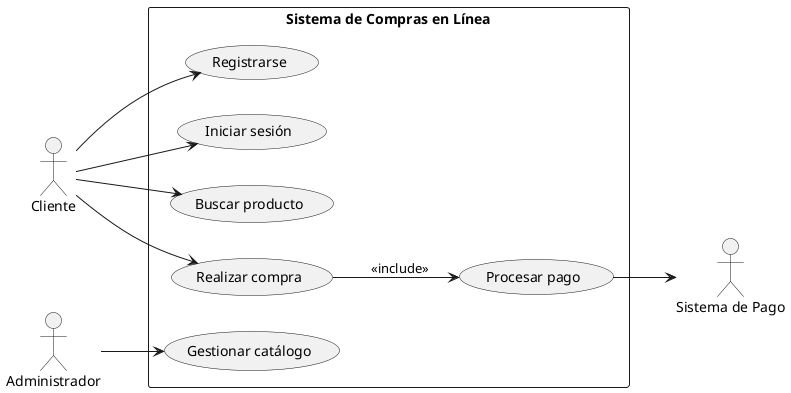

# Documentación: Diagrama de Casos de Uso UML

## Concepto General

El **Diagrama de Casos de Uso** en UML es un tipo de diagrama **comportamental** que modela las interacciones entre los **usuarios (actores)** y un **sistema**. Su objetivo es capturar los **requerimientos funcionales**, mostrando qué hace el sistema desde el punto de vista del usuario, sin detallar la implementación interna.

Es una herramienta esencial en la fase de **análisis de requisitos**, ya que permite comunicar de manera clara las funcionalidades del sistema con clientes, usuarios y desarrolladores.

---

## Elementos Principales

1. **Actor**
   
   - Representa un rol que interactúa con el sistema (puede ser una persona, otro sistema o un dispositivo).
   - Se dibuja con una figura de "muñeco de palo".
   - Ejemplo: Cliente, Administrador, Sistema de Pago.

2. **Caso de Uso**
   
   - Describe una funcionalidad o servicio que el sistema ofrece a los actores.
   - Se representa con una elipse.
   - Ejemplo: "Realizar compra", "Iniciar sesión".

3. **Sistema**
   
   - Es el límite donde se encuentran los casos de uso.
   - Se representa como un rectángulo que contiene todos los casos de uso del sistema.

4. **Relaciones**
   
   - **Asociación (línea simple):** Conecta actores con casos de uso.
   - **Include (<<include>>):** Un caso de uso siempre incluye la funcionalidad de otro.
   - **Extend (<<extend>>):** Un caso de uso puede extenderse opcionalmente con otro, dependiendo de una condición.
   - **Generalización:** Un actor o caso de uso puede heredar de otro (especialización).

---

## Objetivos del Diagrama de Casos de Uso

- Representar los **requerimientos funcionales** del sistema.
- Facilitar la comunicación entre el equipo de desarrollo y los interesados.
- Servir como base para la **documentación de requerimientos** y casos de prueba.
- Ayudar a definir los **límites del sistema** y sus interacciones externas.

---

## Ventajas

- **Claridad:** Explica qué hace el sistema de forma entendible para usuarios no técnicos.
- **Comunicación:** Sirve de puente entre desarrolladores y clientes.
- **Análisis:** Permite identificar redundancias, dependencias y prioridades en los requerimientos.
- **Base para pruebas:** Se pueden derivar escenarios de prueba a partir de los casos de uso.

---

## Ejemplo (Sistema de Compras en Línea)

### Actores:

- Cliente
- Administrador
- Sistema de Pago

### Casos de uso:

- Registrarse
- Iniciar sesión
- Buscar producto
- Realizar compra
- Procesar pago
- Gestionar catálogo

### Relaciones:

- "Realizar compra" <<include>> "Procesar pago".
- "Registrar usuario" <<extend>> "Verificar correo".

---

## Ejemplo en PlantUML

