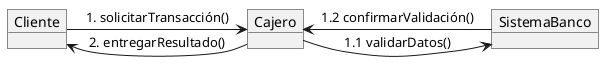

# Documentación: Diagrama de Comunicación (UML)

## Concepto

El **diagrama de comunicación** en UML es un **diagrama de comportamiento** que se utiliza para modelar las **interacciones entre objetos** en un sistema, mostrando cómo colaboran mediante el envío de **mensajes**.  
Se centra en la **estructura estática** de los objetos y su **comunicación dinámica**, resaltando las relaciones entre ellos y el orden en que se intercambian mensajes.

## Objetivos

- Representar cómo los objetos interactúan para cumplir un propósito.
- Mostrar la colaboración entre instancias (objetos) a través de mensajes.
- Complementar la información presentada en los **diagramas de secuencia**, pero enfocándose en la **organización de los objetos**.
- Ayudar a comprender cómo se implementa un caso de uso en términos de interacción entre objetos.

## Elementos principales

1. **Objetos (instancias)**  
   
   - Representan las entidades que participan en la interacción.  
   - Se muestran con el formato: `nombreObjeto : Clase`.

2. **Líneas de asociación**  
   
   - Representan la relación de comunicación entre los objetos.  
   - No implican relación estructural, sino solo una colaboración temporal.

3. **Mensajes**  
   
   - Se representan como flechas numeradas que indican la **secuencia** de los eventos.  
   - El número define el **orden cronológico** de ejecución (ej. `1`, `1.1`, `1.2`, `2`).

4. **Orden de los mensajes**  
   
   - Se usa **numeración secuencial jerárquica** (similar a un índice).  
   - Ejemplo:  
     - `1` → mensaje inicial  
     - `1.1` → mensaje subordinado al anterior  
     - `2` → siguiente mensaje principal  

5. **Condiciones / Iteraciones**  
   
   - Pueden especificarse entre corchetes:  
     - Ejemplo: `[condición] mensaje`  
     - Ejemplo: `* mensaje` para indicar repetición.

## Ventajas

- Muestra tanto la **estructura estática** como la **dinámica** de las interacciones.
- Fácil de entender cuando se requiere visualizar **qué objetos participan** y **cómo se comunican**.
- Ideal para **modelar casos de uso en detalle**.

## Limitaciones

- Puede volverse complejo con muchos objetos o interacciones.
- El orden de ejecución puede no ser tan claro como en un diagrama de secuencia.
- Menos intuitivo para representar **flujos temporales complejos**.

## Ejemplo (PlantUML)

