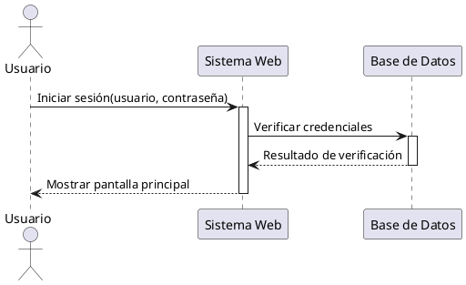

# Documentación: Diagrama de Secuencia (UML)

## Concepto

El **Diagrama de Secuencia** en UML es un diagrama de comportamiento que muestra la interacción entre objetos o componentes del sistema en el tiempo. Representa **cómo los objetos colaboran** enviándose mensajes de manera secuencial para cumplir un flujo específico de un caso de uso o un escenario.

Se enfoca en el **orden temporal** de los mensajes, mostrando la dinámica del sistema más que su estructura estática.

---

## Objetivos

- Modelar el **flujo de mensajes** entre objetos o actores.
- Visualizar el **orden temporal** de las interacciones.
- Comprender cómo un **caso de uso** se implementa paso a paso.
- Detectar responsabilidades y dependencias entre objetos.
- Documentar y comunicar procesos del sistema de forma clara.

---

## Elementos principales

1. **Actores**: Entidades externas que interactúan con el sistema.
2. **Objetos / Clases / Componentes**: Elementos internos que participan en la interacción.
3. **Líneas de vida (Lifelines)**: Líneas verticales que representan la existencia de un objeto a lo largo del tiempo.
4. **Mensajes**:
   - **Síncronos** (llamadas a métodos).
   - **Asíncronos** (envío de señales o eventos).
   - **Respuestas** (devolución de resultados).
5. **Bloques de activación**: Rectángulos sobre las líneas de vida que muestran el periodo en el que un objeto está realizando una acción.
6. **Fragmentos de interacción** (opcionales):
   - **alt**: Alternativa (if/else).
   - **opt**: Opción (condicional).
   - **loop**: Repetición.
   - **par**: Paralelismo.

---

## Ventajas

- Representa de forma clara la **dinámica** de un sistema.
- Útil para **documentar casos de uso** de manera detallada.
- Ayuda a identificar **mensajes redundantes o innecesarios**.
- Facilita el entendimiento entre equipos técnicos y de negocio.

---

## Ejemplo en PlantUML

