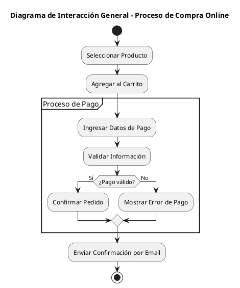

# Documentación: Diagrama de Interacción General (UML)

## Concepto

El **Diagrama de Interacción General** en UML es una representación que combina características de los diagramas de actividades y de secuencia, permitiendo modelar interacciones complejas en un sistema.  
Se utiliza principalmente para **describir el flujo de control entre diferentes interacciones**, como secuencias, comunicaciones y actividades, dentro de un contexto más amplio.

Este diagrama ofrece una **visión de alto nivel de los escenarios de interacción**, mostrando cómo se conectan diferentes interacciones, condiciones y ciclos, sin entrar en tanto detalle como un diagrama de secuencia específico.

---

## Objetivo

- Modelar **flujos de interacción complejos** en un sistema.  
- Facilitar la **comprensión de procesos de negocio** o sistemas distribuidos.  
- Representar **condiciones, repeticiones, ramificaciones y combinaciones** de interacciones.  
- Integrar de forma **estructurada** distintas interacciones como secuencias, actividades o comunicaciones.  

---

## Elementos principales

1. **Nodos de interacción**
   
   - Representan puntos donde se ejecuta una interacción concreta (secuencia, comunicación, etc.).  
   - Se pueden reutilizar interacciones ya definidas.

2. **Flujos de control**
   
   - Flechas que indican el orden de ejecución de los nodos de interacción.  

3. **Regiones de interacción**
   
   - Sirven para modelar:
     - **Loop (bucle):** Repetición de una interacción.  
     - **Alt (alternativa):** Representa decisiones o ramas.  
     - **Opt (opcional):** Indica un fragmento opcional.  
     - **Par (paralelo):** Interacciones que ocurren al mismo tiempo.  

4. **Condiciones de guarda**
   
   - Restricciones que deben cumplirse para que un flujo ocurra.  

5. **Inicio y fin**
   
   - Nodo inicial (punto de entrada).  
   - Nodo final (término de la interacción).  

---

## Ventajas

- Permite **visualizar interacciones de manera global** en lugar de solo detallada.  
- Facilita la **documentación de procesos de negocio** y sistemas distribuidos.  
- Se integra bien con otros diagramas UML (secuencia, actividades, estados).  
- Ayuda a **identificar dependencias y condiciones** en interacciones complejas.  

---

## Ejemplo básico en PlantUML

