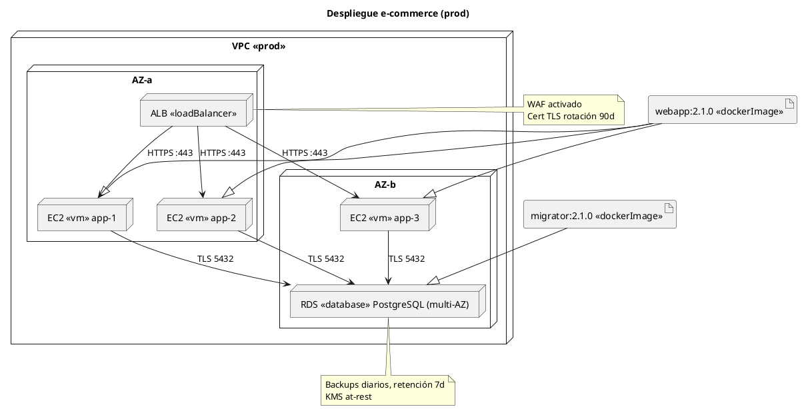

# Documentación completa: Diagrama de Despliegue (UML)

## 1) ¿Qué es un diagrama de despliegue?

El **diagrama de despliegue** (Deployment Diagram) modela la **arquitectura física** de un sistema: dónde **se ejecutan** los componentes software y **cómo se conectan** los **nodos** de hardware y/o plataformas de ejecución. Responde a preguntas como:

- ¿En qué servidores/dispositivos corre cada parte del sistema?
- ¿Cómo se comunican entre sí (redes, protocolos, puertos)?
- ¿Qué artefactos se instalan y en qué entorno?

---

## 2) Objetivos principales

- **Visualizar la topología** del sistema en producción, pre, QA o dev.
- **Asignar artefactos** (binarios, contenedores, war/jar, imágenes Docker) a nodos.
- **Documentar conexiones** (latencia, protocolos, puertos, balanceadores, firewalls).
- **Evidenciar no-funcionales**: disponibilidad, escalabilidad, redundancia, seguridad.
- **Facilitar DevOps**: despliegue, versionado, rollback y observabilidad.

---

## 3) Elementos clave del diagrama

### 3.1 Nodos

- **Nodo (Node)**: unidad de ejecución o recurso computacional.
  - **Dispositivo**: hardware físico (servidor, móvil, IoT, router).
  - **Entorno de ejecución**: plataforma que hospeda software (JVM, .NET CLR, contenedor Docker, Kubernetes Pod/Node, servidor de apps).
- **Estereotipos comunes**:
  - `«device»` (físico), `«executionEnvironment»` (VM/Runtime), `«database»`, `«gateway»`, `«loadBalancer»`, `«k8s-node»`, `«pod»`, `«vm»`.
- **Atributos útiles** (opcional): SO, CPU/RAM, zona/region, AZ, etiquetas (labels), versión, variables de entorno.

### 3.2 Artefactos

- **Artefacto (Artifact)**: producto desplegable del proceso de build.
  - Ej.: `app.jar`, `web.war`, `service.exe`, imagen `myapp:1.2.3`, script `.sh`, bundle front `dist/`.
- **Manifestación**: un **componente lógico** (del diagrama de componentes) es **manifestado** por uno o más artefactos.
- **Estereotipos**: `«artifact»`, `«dockerImage»`, `«helmChart»`, `«script»`, `«config»`.

### 3.3 Relaciones

- **Despliegue (Deployment)**: asigna **artefacto → nodo**.
- **Comunicación (Communication Path)**: enlace entre nodos (físico o lógico).
  - Puede detallar **protocolo** (HTTP/2, gRPC, AMQP), **puerto**, **cifrado** (TLS), **QoS**.
- **Dependencias**: artefacto/entorno que requiere otro (p. ej., app → base de datos).
- **Asociaciones/Composición**: nodos conteniendo otros nodos (host → VM → contenedor → proceso).

### 3.4 Paquetes y jerarquía

- **Paquetes** para agrupar por **ambiente** (dev/qa/prod), **zona** (us-east-1, eu-west-3), **dominio** (frontend/backend/data).
- **Nodos anidados** para reflejar **capas**: Físico → VM → Runtime → Proceso/Artifact.

---

## 4) Notación y estereotipos útiles

- **Nodo**: caja 3D (o rectángulo con `«node»`).
- **Dispositivo**: `«device»` + ícono/nota de hardware.
- **Entorno**: `«executionEnvironment»` (JVM, Node.js, Python venv, App Server).
- **Artefacto**: rectángulo con `«artifact»` y nombre/versión.
- **Camino de comunicación**: línea sólida entre nodos con etiqueta `proto:puerto` y (opcional) latencia/SLAs.
- **Notas**: requisitos de red, secretos, configuración.
- **Multiplicidad / Escalado**: `xN` (e.g., `ReplicaSet x3`, `ASG min2–max6`), `[*]` desconocido o autoescalado.
- **Clusters**: usar contención/paquetes y estereotipos `«cluster»`, `«k8s-cluster»`.

---

## 5) Qué detallar (checklist)

- **Ambiente**: prod / staging / QA / dev.
- **Topología**: subredes/VPC/VNet, zonas/regions, balanceadores, WAF/gateway.
- **Conectividad**: protocolos, puertos, firewall/NACL/SG, túneles/VPN/peering.
- **Despliegues**: qué artefacto va en qué nodo, versión, estrategia (rolling, blue/green, canary).
- **Disponibilidad**: replicas, AZ multi-region, health checks, readiness/liveness.
- **Datos**: motores (PostgreSQL, MongoDB), HA/replicación, backups, cifrado at-rest/in-transit.
- **Observabilidad**: logs, métricas, trace, agentes (Prometheus, OpenTelemetry).
- **Seguridad**: secretos, KMS, IAM/roles, certificados, rotación.
- **Rendimiento**: límites de recursos, HPA/VPA, colas/caches (Redis), CDNs.
- **Operación**: pipelines CI/CD, artefactos firmados, rollback, feature flags.

---

## 6) Niveles de detalle (según audiencia)

- **Vista ejecutiva**: pocos nodos, flujos principales, AZ/regions, SLA.
- **Vista arquitectónica**: nodos, protocolos, puertos, replicas, dependencias críticas.
- **Vista operativa/DevOps**: subredes, SG/firewalls, imágenes/tags, probes, jobs, secretos.

---

## 7) Patrones frecuentes

- **3 capas**: `Client` → `Web/App` → `DB`.
- **Microservicios**: `Ingress/WAF` → `Gateway/API` → `Services` (+ service mesh) → `DB/Cache/Queue`.
- **Event-driven**: productores → broker (Kafka/Rabbit) → consumidores → almacenes/ETL.
- **Edge/CDN**: Cliente → CDN/WAF → Origin (LB) → App.
- **ML/Batch**: orquestador (Airflow) → workers → lago de datos → modelos/serving.

---

## 8) Buenas prácticas

- **Modelar por ambientes** (uno por diagrama o capas separadas).
- **Nombrar consistente**: `<dominio>-<rol>-<ambiente>-<zona>`.
- **Etiquetar puertos/protocolos** en *cada* enlace.
- **Mostrar multiplicidad** y **zonas/regions** para HA.
- **Separar responsabilidades**: datos, cómputo, red, seguridad.
- **Resumir supuestos y restricciones** en notas.
- **Mantener sincronizado** con IaC (Terraform/Helm) y pipeline CI/CD.
- **Versionar** el diagrama junto al código.

---

## 9) Errores comunes

- Mezclar **lógico** (componentes) con **físico** sin distinguir (usar estereotipos).
- Omitir **puertos/protocolos** o **reglas de red**.
- No mostrar **replicas/zonas** → oculta riesgos de disponibilidad.
- Detallar **demasiado** (IPs dinámicas, seriales) que envejecen rápido.
- No incluir **dependencias externas** (SaaS, APIs de terceros).

---

## 10) Proceso recomendado para construirlo

1. **Identificar contextos** y límites (SaaS/externos).
2. **Inventariar nodos** por ambiente (físicos, VMs, contenedores, runtimes).
3. **Mapear artefactos** y su **manifestación** de componentes.
4. **Dibujar topología de red** (subredes, LB, seguridad).
5. **Conectar nodos** con **protocolos/puertos** y **SLAs**.
6. **Anotar no-funcionales** (HA, seguridad, observabilidad).
7. **Revisar con equipos** (arquitectura, DevOps, seguridad).
8. **Versionar** y mantenerlo vivo con cambios de despliegue.

---

## 11) Mini-glosario

- **Nodo**: recurso donde corre software.
- **Artefacto**: paquete desplegable resultado del build.
- **Deployment**: relación artefacto→nodo.
- **Communication Path**: conexión entre nodos.
- **Execution Environment**: plataforma de runtime hospedada en un nodo.
- **Manifestation**: artefacto que implementa un componente lógico.

---

## 12) Ejemplo en texto (PlantUML de referencia, opcional)

