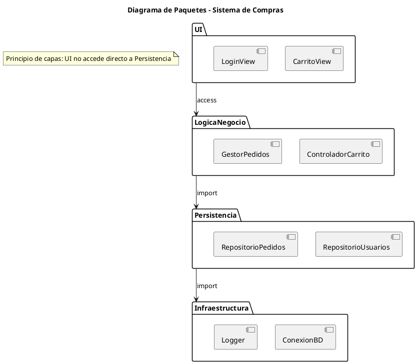

# Documentación completa: Diagrama de Paquetes (UML)

## 1) ¿Qué es un diagrama de paquetes?

El **diagrama de paquetes** (Package Diagram) en UML representa la **organización y agrupación** de los elementos de un sistema en **paquetes lógicos**. Un paquete es un contenedor que permite modularizar y estructurar el modelo para **gestionar la complejidad**, mejorar la **legibilidad** y favorecer la **reutilización**.

---

## 2) Objetivos principales

- **Organizar el modelo** en grupos coherentes (módulos, capas, subsistemas).
- **Mostrar dependencias** y relaciones de visibilidad entre paquetes.
- **Definir arquitectura lógica** y reglas de modularización.
- **Favorecer mantenibilidad** al dividir el sistema en partes menos acopladas.
- **Soportar planificación** de equipos y responsabilidades.

---

## 3) Elementos clave del diagrama

### 3.1 Paquetes

- Unidad de organización de elementos UML (clases, interfaces, componentes).
- Representado como una **carpeta** (rectángulo con pestaña superior).
- Puede contener:
  - Clases, interfaces, componentes, casos de uso, subpaquetes.
- **Estereotipos comunes**:
  - `«framework»`, `«layer»`, `«subsystem»`, `«utility»`, `«api»`.

### 3.2 Relaciones entre paquetes

- **Dependencia** (`«import»` o `«access»`):
  - `«import»`: un paquete puede usar **todos los elementos públicos** de otro.
  - `«access»`: un paquete solo tiene acceso a los elementos especificados.
- **Generalización**: un paquete puede heredar de otro (menos frecuente).
- **Composición / Contención**: paquetes dentro de otros (jerarquía).
- **Asociaciones**: indicar colaboración entre elementos de distintos paquetes.

### 3.3 Visibilidad y encapsulación

- **Público** (+): accesible desde otros paquetes.
- **Privado** (–): accesible solo dentro del paquete.
- **Protegido** (#): accesible por subpaquetes.
- Esto permite aplicar **principios de encapsulamiento** y modularidad.

---

## 4) Notación y estereotipos útiles

- **Paquete**: rectángulo con pestaña en la esquina superior izquierda.
- **Subpaquete**: paquete contenido dentro de otro.
- **Dependencia**: flecha discontinua de un paquete al que depende.
- **Importación**: flecha discontinua con `«import»`.
- **Acceso**: flecha discontinua con `«access»`.
- **Estereotipos**: definen rol, por ejemplo:
  - `«layer»` para capas lógicas.
  - `«subsystem»` para subsistemas.
  - `«framework»` para librerías externas.
  - `«utility»` para paquetes auxiliares.

---

## 5) Qué detallar (checklist)

- [ ] ¿Cómo se agrupan los elementos en paquetes?
- [ ] ¿Qué dependencias existen entre paquetes?
- [ ] ¿Se respeta la **independencia de capas**?
- [ ] ¿Se definen reglas de **visibilidad pública/privada**?
- [ ] ¿Están reflejadas las librerías/frameworks externas?
- [ ] ¿Hay modularización coherente (dominios, servicios, utilidades)?

---

## 6) Niveles de detalle (según audiencia)

- **Vista conceptual**: solo paquetes principales y sus relaciones.
- **Vista de arquitectura**: capas lógicas (UI, lógica de negocio, datos).
- **Vista de implementación**: subpaquetes detallados, librerías, dependencias cruzadas.

---

## 7) Patrones frecuentes

- **Arquitectura en capas**:
  - `UI` → `Negocio` → `Persistencia` → `Infraestructura`.
- **Modularización por dominio** (Domain-Driven Design):
  - Paquetes por contexto (Clientes, Pedidos, Facturación).
- **Paquetes de servicios y utilidades**:
  - `Core`, `Utils`, `API`, `Adapters`, `External`.

---

## 8) Buenas prácticas

- Mantener paquetes **cohesivos** (todo lo que hay dentro está relacionado).
- Minimizar dependencias circulares.
- Aplicar **principio de dependencia acíclica** (ADP).
- Nombrar paquetes de forma clara (dominio o función).
- Separar **código de dominio** de **infraestructura y utilidades**.
- Documentar dependencias externas (frameworks, librerías, APIs).

---

## 9) Errores comunes

- Paquetes demasiado grandes (rompen modularidad).
- Dependencias circulares (dificultan mantenimiento y pruebas).
- No distinguir entre capas de responsabilidad.
- Incluir demasiados niveles jerárquicos (excesiva complejidad).
- Usar paquetes sin estereotipos ni propósito definido.

---

## 10) Proceso recomendado para construirlo

1. **Identificar módulos/límites** del sistema.
2. **Definir paquetes principales** (capas, subsistemas, dominios).
3. **Asignar elementos** (clases, interfaces, componentes) a cada paquete.
4. **Definir dependencias** (import, access) y visibilidad de elementos.
5. **Eliminar ciclos** y dependencias innecesarias.
6. **Anotar estereotipos** y roles de paquetes.
7. **Revisar modularidad** con el equipo de arquitectura.

---

## 11) Mini-glosario

- **Paquete**: agrupación lógica de elementos UML.
- **Dependencia**: relación de uso entre paquetes.
- **Import**: acceso completo a elementos públicos de otro paquete.
- **Access**: acceso limitado a elementos especificados.
- **Encapsulación**: control de visibilidad de elementos del paquete.

---

## 12) Ejemplo en texto (PlantUML de referencia, opcional)

