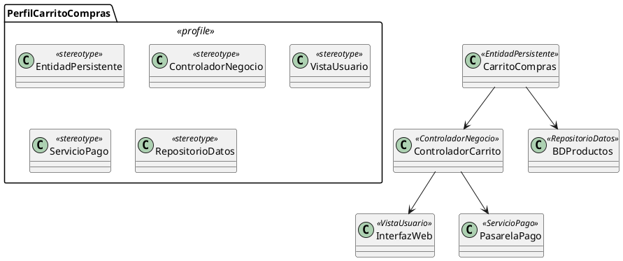

# Documentación completa: Diagrama de Perfiles (UML)

## 1) ¿Qué es un diagrama de perfiles?

El **diagrama de perfiles** (Profile Diagram) en UML permite **extender el metamodelo de UML** para adaptarlo a un dominio, plataforma o metodología específica.  
Es una herramienta de **personalización** que define nuevas construcciones semánticas mediante **estereotipos, etiquetas y restricciones**, sin necesidad de crear un lenguaje nuevo.

Se utiliza para adaptar UML a **modelado de sistemas específicos** (ej. telecomunicaciones, sistemas embebidos, SOA, BPM, DevOps).

---

## 2) Objetivos principales

- Adaptar UML a un **dominio concreto** sin perder compatibilidad con el estándar.
- Definir **estereotipos** que amplían el significado de elementos UML.
- Asignar **valores etiquetados** (tagged values) para propiedades adicionales.
- Restringir el uso de elementos UML según un contexto.
- Facilitar el **modelado específico de dominio (DSM)**.

---

## 3) Elementos clave del diagrama

### 3.1 Perfil (Profile)

- Paquete especial que agrupa **extensiones de UML**.
- Representado como un rectángulo con el estereotipo `«profile»`.

### 3.2 Estereotipos (Stereotypes)

- Definen **variantes especializadas** de elementos UML existentes.
- Se aplican a clases, componentes, nodos, casos de uso, etc.
- Representados con el estereotipo `«stereotype»`.
- Ejemplo: `«controller»`, `«boundary»`, `«entity»`.

### 3.3 Valores etiquetados (Tagged Values)

- Propiedades adicionales definidas por un estereotipo.
- Ejemplo: `timeout=30s`, `author="Brayan"`, `version="1.2.0"`.

### 3.4 Restricciones (Constraints)

- Condiciones que deben cumplirse cuando se aplica un estereotipo.
- Pueden expresarse en OCL (Object Constraint Language).
- Ejemplo: `<<database>>` debe estar asociado solo a nodos.

### 3.5 Metaclases (Metaclasses)

- Elementos UML estándar a los que se aplica la extensión.
- Ejemplo: un estereotipo `«service»` extiende la metaclase `Class`.

---

## 4) Notación y estereotipos útiles

- **Profile**: paquete con `«profile»`.
- **Stereotype**: clase especial con `«stereotype»`.
- **Metaclass**: clase con `«metaclass»`.
- **Tagged Value**: atributo dentro de un estereotipo.
- **Extensión (Extension)**: línea con rombo vacío desde estereotipo → metaclase.
- **Restricciones**: notas o expresiones OCL ligadas al estereotipo.

---

## 5) Qué detallar (checklist)

- [ ] ¿Qué dominio o contexto se desea modelar?
- [ ] ¿Qué elementos UML deben especializarse?
- [ ] ¿Qué estereotipos se requieren y qué representan?
- [ ] ¿Qué propiedades adicionales deben definirse (tagged values)?
- [ ] ¿Existen restricciones que limiten su aplicación?
- [ ] ¿Cómo se agrupan dentro de perfiles?

---

## 6) Niveles de detalle (según audiencia)

- **Vista simple**: solo estereotipos principales y sus metaclases.
- **Vista técnica**: estereotipos con atributos/tagged values.
- **Vista avanzada**: restricciones formales en OCL, perfiles combinados.

---

## 7) Patrones frecuentes

- **Arquitectura 3 capas (UML estándar)**: `«boundary»`, `«control»`, `«entity»`.
- **Perfiles de sistemas embebidos**: `«device»`, `«sensor»`, `«actuator»`.
- **Modelado de servicios (SOA)**: `«service»`, `«endpoint»`, `«message»`.
- **Perfiles de seguridad**: `«encrypted»`, `«authenticated»`.
- **Perfiles DevOps**: `«container»`, `«pipeline»`, `«deployment»`.

---

## 8) Buenas prácticas

- Definir perfiles **ligeros y específicos** al dominio.
- Usar nombres claros y consistentes para estereotipos.
- Documentar **valores etiquetados** para cada estereotipo.
- Evitar redundancias: un estereotipo debe tener un propósito único.
- Asegurar compatibilidad con herramientas UML que soporten perfiles.

---

## 9) Errores comunes

- Crear demasiados estereotipos innecesarios (sobrecarga).
- No definir restricciones claras, lo que causa ambigüedad.
- Usar perfiles como reemplazo de UML en lugar de extensión.
- No documentar valores etiquetados, dificultando su uso práctico.

---

## 10) Proceso recomendado para construirlo

1. Identificar el **dominio** que necesita extensiones.
2. Crear un **perfil UML** (`«profile»`).
3. Definir **metaclases** de UML que se van a extender.
4. Crear **estereotipos** para especializar esos elementos.
5. Añadir **valores etiquetados** y **restricciones**.
6. Conectar estereotipos con metaclases mediante **extensiones**.
7. Validar el perfil en un **caso de uso real**.

---

## 11) Mini-glosario

- **Perfil (Profile)**: paquete de extensiones de UML.
- **Estereotipo (Stereotype)**: especialización de un elemento UML.
- **Valor etiquetado (Tagged Value)**: propiedad adicional de un estereotipo.
- **Restricción (Constraint)**: regla que debe cumplirse en el perfil.
- **Metaclase (Metaclass)**: elemento UML base que se extiende.
- **Extensión (Extension)**: relación entre estereotipo y metaclase.

---

## 12) Ejemplo en texto (PlantUML de referencia, opcional)

