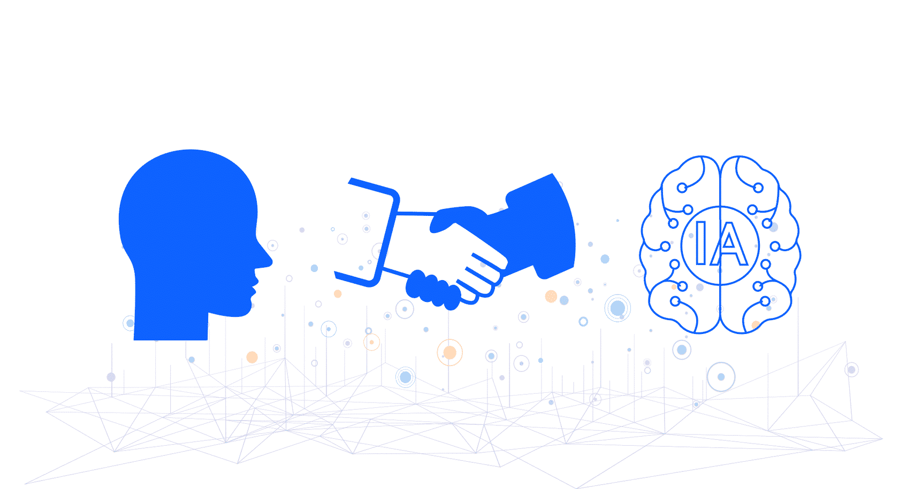
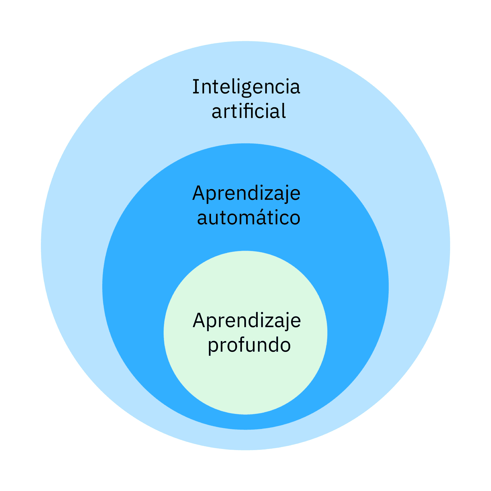
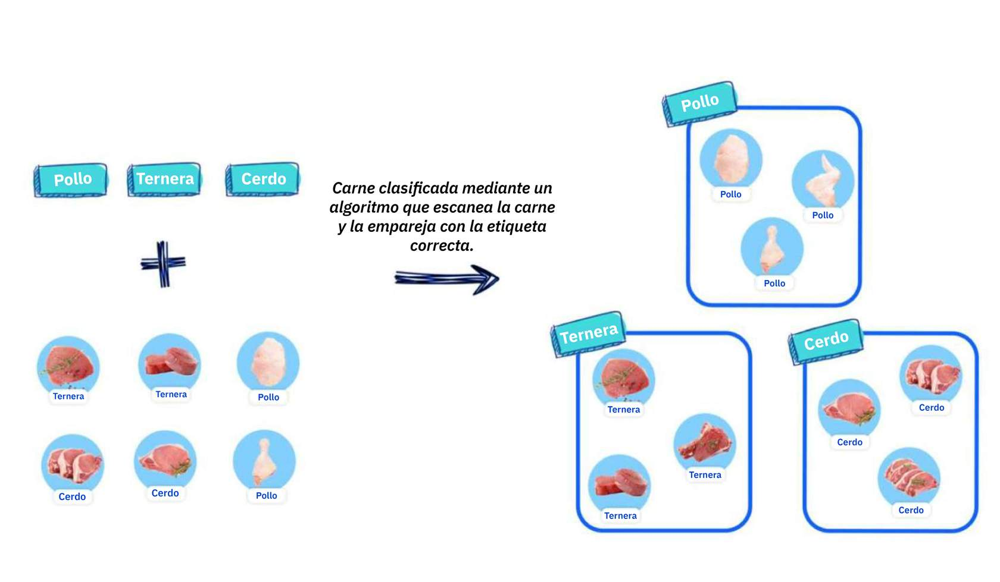
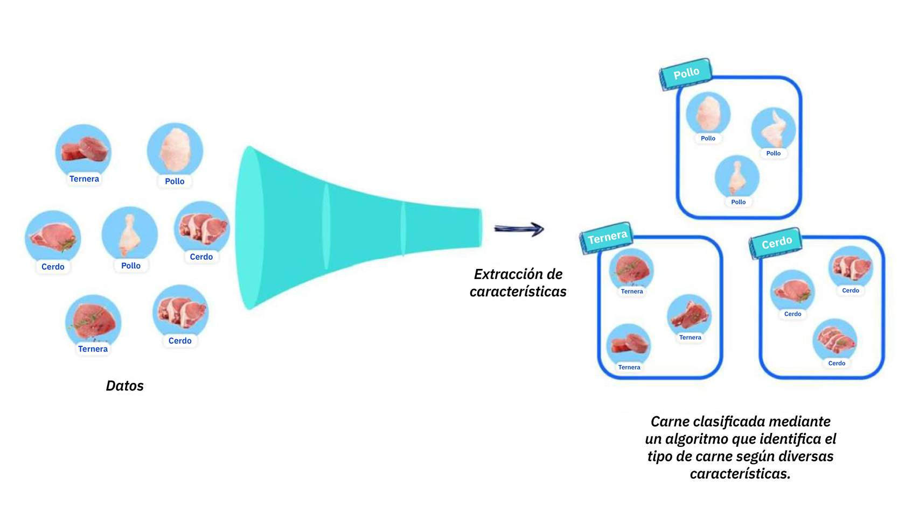
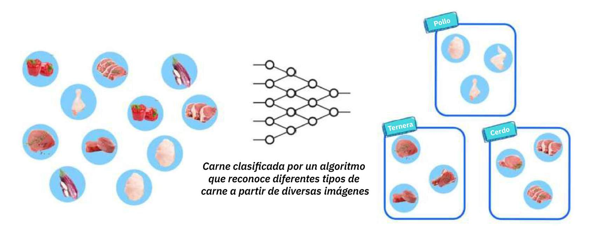

# Módulo 1  
## Submódulo 1: ¿Qué es la Inteligencia Artificial?

---

## Introducción
En este submódulo aprendí a responder a una pregunta clave: **¿qué es la Inteligencia Artificial (IA)?**  
Al inicio, descubrí que la IA es un campo relativamente joven, con menos de un siglo de historia, pero que ha tenido un impacto enorme en el mundo. Hoy está tan integrada en la vida diaria que muchas veces ni siquiera la notamos.  

La IA no sustituye al ser humano, sino que lo **acompaña y potencia**. Es una herramienta que nos ayuda a procesar datos de manera más rápida, encontrar patrones y realizar predicciones que antes habrían sido imposibles de calcular a mano.  

---

## ¿Qué es la IA?
La **Inteligencia Artificial** es la capacidad de una máquina para **aprender patrones y realizar predicciones**.  
En palabras simples, no es una máquina que “piensa” como nosotros, sino que **analiza datos** y saca conclusiones basadas en ellos.  
 
Aprendí también la diferencia entre dos conceptos que suelen confundirse:  
- **Inteligencia Artificial (IA):** intenta imitar procesos humanos de razonamiento y decisión.  

- **Inteligencia Aumentada:** busca ayudarnos a realizar tareas que los humanos no podríamos hacer solos, como analizar miles de documentos en pocos minutos.  

En pocas palabras, la IA **no reemplaza nuestro juicio humano**, sino que lo refuerza y lo hace más eficiente.  

---

## ¿Qué hace la IA en la práctica?
La IA funciona principalmente en dos pasos:  
1. **Analiza grandes cantidades de datos:** los clasifica, organiza y encuentra patrones que serían imposibles de detectar manualmente.  
2. **Hace predicciones:** a partir de esos patrones, puede anticipar lo que probablemente sucederá.  
 

Ejemplos que me resultaron cercanos:  
- La **corrección automática** en mi celular, que predice la palabra correcta cuando escribo mal.  
- Los **chatbots**, que usan procesamiento del lenguaje para responder a preguntas en línea.  
- Los **sistemas de visión por computadora**, que ayudan a identificar enfermedades o guiar autos autónomos.  
- La **detección de fraudes** en bancos, que analiza patrones de compras y detecta movimientos sospechosos.  

Esto me hizo darme cuenta de que la IA ya está en casi todas partes, desde lo más cotidiano hasta lo más crítico.  

---

## Niveles de Inteligencia Artificial
Algo muy interesante fue conocer los **tres niveles de la IA**:  

1. **IA Estrecha (o débil):** se enfoca en una tarea muy específica, como recomendar una película o reconocer una voz. Es la más común hoy en día.  
2. **IA Amplia:** es más versátil, capaz de manejar varias tareas relacionadas y adaptarse mejor a distintos contextos. Se usa en predicciones climáticas, salud o negocios.  
3. **IA General:** aún no existe, pero sería una IA capaz de pensar, aprender y razonar como un ser humano.  

Incluso se menciona la posibilidad de un futuro con **superinteligencia artificial**, una máquina que podría superar nuestras capacidades intelectuales. Pero, por ahora, esto sigue siendo una proyección a largo plazo.  

---

## Ejemplo práctico: supermercado y clasificación
Para comprenderlo mejor, vi un ejemplo muy ilustrativo:  
Imaginemos que debo clasificar productos en un supermercado:  

- Con **IA básica** puedo crear reglas simples, como “si dice pollo, va a esta canasta”. 
 
- Con **aprendizaje automático**, entreno al sistema con más datos (color, tamaño, forma) para que identifique los productos con mayor precisión.  
 
- Con **aprendizaje profundo**, el sistema ya no necesita que le dé tantas reglas: analiza las imágenes directamente y, mediante redes neuronales, aprende a distinguir por sí solo los distintos tipos de carne.  

Este ejemplo me ayudó a visualizar cómo cada nivel de IA agrega más autonomía e inteligencia al proceso.  

---

## Reflexión personal
Este submódulo me dejó claro que la IA no es magia ni algo lejano: **ya es parte de mi vida diaria**.  
La clave está en que la IA no busca sustituirnos, sino complementarnos. Nosotros seguimos aportando creatividad, criterio y contexto, mientras que la IA ofrece rapidez, análisis de datos y capacidad de predicción.  

Entendí también que el desarrollo de la IA seguirá creciendo gracias al aumento del poder de cómputo y la disponibilidad de grandes volúmenes de datos. Esto significa que en el futuro la veremos en aún más áreas: desde el trabajo, la salud, la educación, hasta en tareas cotidianas.  

---
