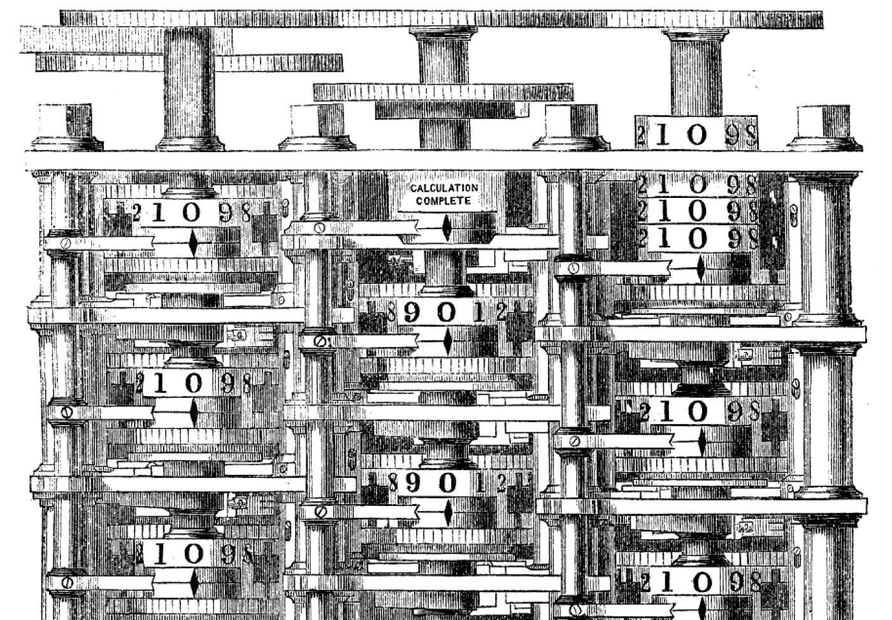
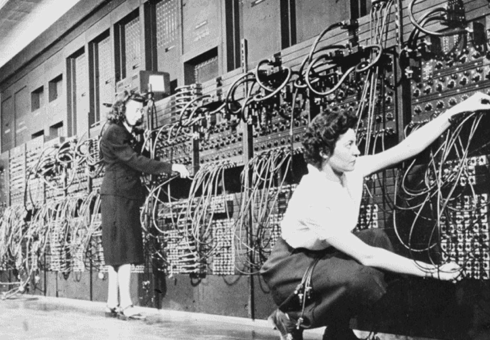
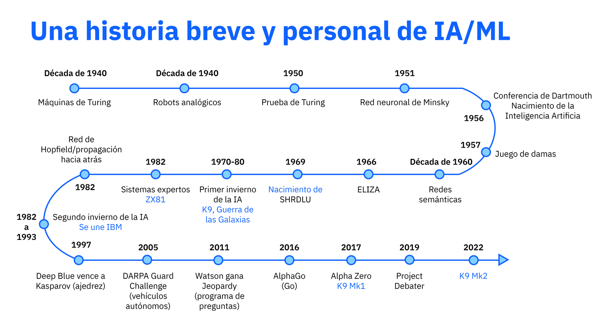

# Módulo 1  
## Submódulo 2: ¿Cuáles son las tres eras de la informática?

---

## Introducción
En este submódulo aprendí cómo la humanidad ha manejado y analizado **datos a lo largo de los siglos**.  
Descubrí que, aunque hoy los datos se generan de manera masiva, siempre hemos buscado formas de **darles sentido** y estructurarlos para tomar decisiones.  

Me llamó mucho la atención el concepto de **“datos oscuros”**, que son todos esos datos sin organizar que por sí solos no nos dicen nada, y cómo el ser humano ha desarrollado herramientas para descifrarlos. 
 
 
---

## Era de la tabulación
Comenzando hace más de 2.000 años, aprendí que los humanos utilizaron herramientas como el **ábaco** para organizar información, por ejemplo, impuestos o recursos.  
Luego, en el siglo XIX, figuras como **Charles Babbage y Ada Lovelace** intentaron crear máquinas capaces de realizar cálculos complejos automáticamente.  
Poco después, **Herman Hollerith** inventó las tarjetas perforadas que permitieron procesar datos masivos, como el Censo de Estados Unidos de 1890, mucho más rápido que antes. 

Aprendí que la palabra clave de esta era es **tabular**: organizar los datos en tablas y estructuras que permitan descubrir patrones y tomar decisiones más informadas.  

---

## Era de la programación
Con la llegada de los ordenadores electrónicos en los años 40, comenzó la **era de la programación**.  
Los científicos desarrollaron sistemas como el **ENIAC**, capaces de ejecutar distintos programas para cálculos variados, desde artillería hasta exploración espacial.  
Estos ordenadores guiaron misiones como el Apolo 13, demostrando que la programación permitió a las máquinas realizar tareas complejas, aunque siempre siguiendo instrucciones humanas.  

Entendí que crecí durante esta era: incluso el teléfono que uso hoy está construido sobre los avances de esa época.  
Sin embargo, los **datos oscuros** seguían siendo un desafío, ya que la capacidad de los ordenadores era limitada frente al volumen de información que generamos hoy.  

---

## Era de la Inteligencia Artificial
Finalmente, llegamos a la **era de la IA**, que comenzó formalmente en **1956** con la conferencia de Dartmouth, donde John McCarthy y Marvin Minsky acuñaron el término “inteligencia artificial”.  
En este período, los investigadores buscaron crear máquinas que pudieran **simular cualquier aspecto del aprendizaje o la inteligencia humana**.  

Aprendí que la IA pasó por sus propios “inviernos” cuando la falta de capacidad de cálculo y almacenamiento limitaba los avances, y que muchos proyectos y empresas cerraron por falta de recursos.  

Pero a partir de los años 90, la combinación de **mayor potencia de cálculo** y **algoritmos más sofisticados** permitió que la IA empezara a resolver problemas complejos:  
- En 1997, **Deep Blue** venció al campeón mundial de ajedrez.  
- En 2005, robots se guiaron de manera autónoma en trayectos largos.  
- En 2011, **Watson de IBM** ganó en el programa Jeopardy!, demostrando capacidades avanzadas de comprensión y análisis de información.  

Hoy la IA está presente en campos como la **medicina, defensa, energía y análisis de grandes datos**, y se ha consolidado como uno de los campos más prometedores de la informática moderna.  

---

## Reflexión personal
Este submódulo me permitió ver que el **avance tecnológico siempre ha estado ligado a nuestra necesidad de entender los datos**.  
Desde el ábaco hasta los sistemas de IA actuales, cada era busca **potenciar nuestra capacidad de procesar información** y tomar decisiones más inteligentes.  
Me queda claro que la IA no surge de la nada: es la culminación de siglos de innovación, y su evolución depende tanto de la tecnología como de cómo los humanos aprendemos a aprovecharla.  

---
