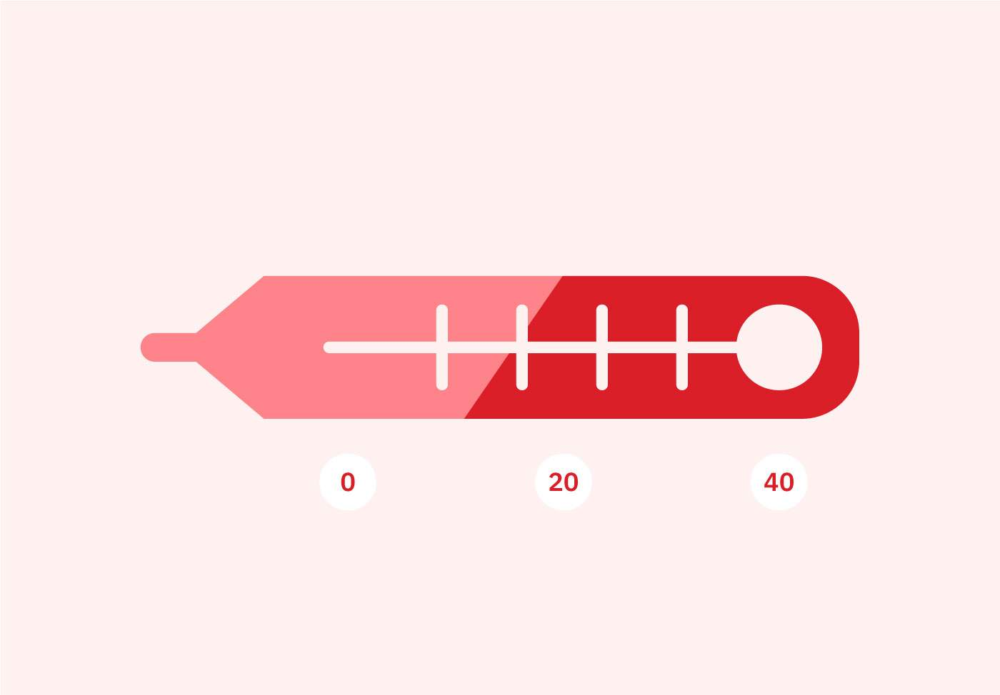

# Módulo 1  
## Submódulo 3: Datos estructurados, semiestructurados y no estructurados

---

## Introducción
En este submódulo aprendí a diferenciar los distintos tipos de **datos** y cómo la Inteligencia Artificial puede trabajar con ellos.  
Descubrí que los datos pueden ser **hechos, estadísticas, opiniones, imágenes, sonidos o incluso movimientos**, y que dependiendo de cómo estén organizados, requieren enfoques distintos para analizarlos.  

---

## Tipos de datos
Aprendí que los datos se clasifican en **tres tipos principales**:

### Datos estructurados
- Son los más organizados y fáciles de procesar.  
- Se pueden almacenar en **filas y columnas**, como en Excel o Google Sheets.  
- Ejemplos: nombres, fechas, direcciones, números de tarjeta de crédito, inventarios.  

### Datos no estructurados
- Son más desordenados y difíciles de analizar con herramientas tradicionales.  
- Carecen de una estructura predefinida.  
- Ejemplos: imágenes, textos, comentarios de clientes, historiales médicos, letras de canciones.  
- También se les llama **datos oscuros** porque esconden información valiosa que no se puede ver fácilmente.  

### Datos semiestructurados
- Son un **puente entre los datos estructurados y no estructurados**.  
- No tienen un modelo de datos fijo, pero usan **metadatos** que facilitan su análisis.  
- Ejemplo: un vídeo en redes sociales. El video en sí es no estructurado, pero puede incluir hashtags, descripciones o etiquetas que permiten organizar y buscar la información.  

---

## La importancia de los datos no estructurados
Aprendí que la **mayoría de los datos que se generan hoy en día** son no estructurados, y que las empresas le dan cada vez más prioridad a gestionarlos correctamente.  
Estos datos contienen respuestas ocultas que pueden ayudar a:  
- Prevenir enfermedades  
- Analizar la actividad delictiva  
- Predecir mercados  
- Mejorar casi todos los aspectos de la civilización moderna  

---

## Cómo la IA ayuda
La IA puede **estructurar rápidamente datos oscuros** y extraer patrones que los humanos tardaríamos años en descubrir.  
Además, puede **aprender de los datos por sí misma**, perfeccionando sus predicciones y ayudando a tomar decisiones más inteligentes con el tiempo.  

Este submódulo me hizo comprender que estamos en una **era en la que la IA transforma completamente la forma en que vemos y usamos los datos**, y que manejar datos no estructurados será cada vez más importante en cualquier carrera relacionada con la tecnología.  

---
