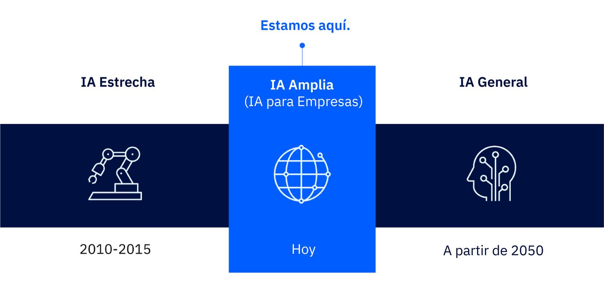
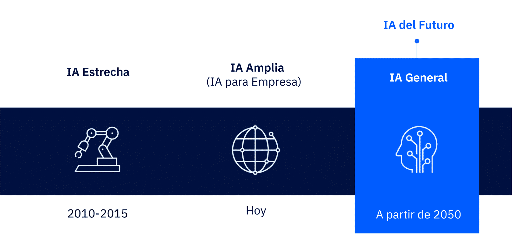

# Módulo 1  
## Submódulo 6: Cómo transformará el aprendizaje automático la vida humana

---

## Introducción
En este submódulo aprendí cómo los humanos podrían experimentar la **IA general** en el futuro y cómo se espera que el **aprendizaje automático** transforme nuestra vida cotidiana. También repasé los tres niveles de inteligencia artificial que ya conocía.  

---

## Repaso de los tres niveles de IA
Sé que actualmente estamos en el nivel de **IA amplia**, que es el que ya se aplica en la mayoría de empresas y tecnologías.  
Sin embargo, se espera que dentro de unos 25 años surja la **IA general**, que según el investigador Nick Bostrom será “mucho más inteligente que los mejores cerebros humanos en prácticamente todos los campos, incluida la creatividad científica, la sabiduría general y las habilidades sociales”.  

Esta IA general permitirá que los **bots superinteligentes** trabajen junto a los humanos y conecten la IA con la **Internet de los objetos**, dándoles la capacidad de interactuar casi como lo haría una persona.  

---

## ¿Cómo cambiará nuestra vida la IA general?
Imaginé cómo sería interactuar con una IA así y lo que descubrí fue fascinante:  

- **IA en todas partes**: La IA se integrará en todos los sectores, desde finanzas hasta educación y sanidad. Aumentará la productividad y generará nuevas oportunidades.  
- **Conocimientos más profundos**: La IA podrá detectar, analizar y comprender cosas que antes eran imposibles de conocer.  
- **Nuevo concepto de compromiso**: Las formas de interactuar con máquinas cambiarán, y tecnologías como los **bots conversacionales** transformarán cómo nos relacionamos entre humanos y con las máquinas.  
- **Personalización**: Las interacciones con la tecnología serán cada vez más personalizadas, con un nivel de detalle impresionante.  
- **Planeta instrumentalizado**: Los sensores conectados a la IA generarán enormes volúmenes de datos que podrán mejorar la seguridad, la sostenibilidad y la protección de la Tierra.  

---

## Reflexión personal
Me quedó claro que en el futuro podríamos vivir en un mundo donde humanos, dispositivos y robots formen un **“cerebro digital” colectivo**, anticipando necesidades, haciendo predicciones y ofreciendo soluciones.  
Incluso podríamos dejar que este cerebro digital actúe en nuestro nombre en muchas tareas cotidianas, aumentando nuestra eficiencia y liberando tiempo para actividades más creativas y significativas.  

Este submódulo me hizo imaginar un futuro donde la **colaboración entre humanos y máquinas** no solo será posible, sino fundamental para vivir mejor y aprovechar al máximo la tecnología.  

---
