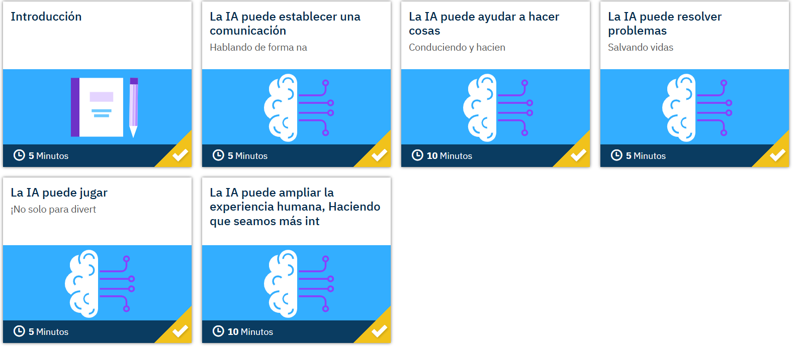

# Módulo Complementario – Inteligencia artificial en la práctica

## Introducción  

En este módulo reflexiono sobre cómo la **IA ya forma parte de nuestras vidas** y cómo se aplica en distintas áreas para mejorar experiencias, resolver problemas y ampliar nuestras capacidades.  

Me llamó mucho la atención recordar el momento histórico en 2011, cuando **IBM Watson** compitió en el concurso Jeopardy! frente a campeones humanos. Para lograrlo, Watson tuvo que analizar **grandes volúmenes de datos de diferentes fuentes**, como Wikipedia y otras bases de información confiables, para poder responder de manera precisa. Fue un ejemplo perfecto de cómo la IA puede procesar información y aprender a un nivel que antes parecía imposible.

---

## La IA entiende el lenguaje humano  

Descubrí que una de las cosas más complejas para una máquina es comprender el lenguaje humano. Los seres humanos aprendemos a procesar frases y a darles sentido desde la infancia, pero un sistema no puede memorizar todas las formas posibles de expresarse.  

Aquí es donde entra el **Procesamiento de Lenguaje Natural (PLN)**, que permite a los sistemas **entender y responder preguntas** de manera coherente. Los **chatbots** son un ejemplo básico: puedo escribirles o decirles algo en lenguaje natural y normalmente comprenden lo que pregunto.  

Los **asistentes virtuales**, como Alexa, Cortana o Siri, utilizan PLN avanzado para entender preguntas más complejas y ofrecer respuestas útiles. Aprendí que a medida que el PLN progresa, la interacción con estos asistentes será cada vez más natural y personalizada.

---

## La IA realiza tareas complejas  

Me impresionó darme cuenta de que la IA puede ejecutar **trabajos complejos** que antes creíamos exclusivos de los humanos. Por ejemplo, los **vehículos autónomos** usan cámaras, radar, LIDAR y GPS para percibir su entorno: superficie de la carretera, señales de tráfico, peatones, condiciones de luz, tráfico, límites de velocidad, etc.  

La IA integra toda esta información de forma rápida y toma decisiones precisas para navegar de manera segura. Esto demuestra que la IA no solo automatiza tareas simples, sino que también puede **resolver problemas en tiempo real y en entornos cambiantes**.

---

## La IA ayuda a descubrir cosas  

Otro aspecto fascinante es cómo la IA **analiza datos para generar recomendaciones personalizadas**. Por ejemplo:  

- **Amazon** me sugiere productos basados en mis compras anteriores.  
- **Netflix** recomienda programas según lo que ya he visto.  
- **LinkedIn** muestra empleos que se adaptan a mi perfil profesional.  

Incluso en la medicina, sistemas como **IBM Watson for Oncology** combinan datos de pacientes con investigación científica para **sugerir tratamientos adaptados a cada caso**, ayudando a salvar vidas y mejorar decisiones clínicas.

---

## La IA en acciones humanitarias  

Aprendí que la IA también puede tener un impacto social. En **Patna, India**, un sistema de previsión de inundaciones alertó a los residentes de manera anticipada y confiable. Esto permitió tomar decisiones preventivas y reducir riesgos.  
La clave, según Sella Nevo de Google, es **entrenar la IA con datos precisos y fiables**, evitando falsos positivos y generando confianza en el sistema.  

Esto me hizo comprender la importancia del concepto **GIGO (Garbage In, Garbage Out)**: si los datos que proporciono a la IA son incorrectos o incompletos, los resultados también lo serán. Por eso, siempre debo preocuparme por la **calidad de los datos** al diseñar sistemas de IA.

---

## La IA en los juegos  

También descubrí que **los juegos han sido un campo de pruebas fundamental para la IA**.  
Programas como **Deep Blue** en ajedrez o **Watson** en Jeopardy! enfrentan desafíos complejos que permiten a los investigadores mejorar algoritmos y preparar la IA para aplicaciones más amplias, como vehículos autónomos o sistemas de análisis de datos médicos.  

Esto me enseñó que incluso las actividades que parecen “divertidas” o triviales tienen un propósito: **permiten que la IA aprenda y se vuelva más sofisticada**.

---

## Inteligencia aumentada  

Finalmente, aprendí sobre la **inteligencia aumentada**, que no busca reemplazar mi juicio, sino **ampliarlo**.  
Herramientas como **AutoDraw de Google** muestran cómo la IA puede complementar mi creatividad: hago un boceto y la aplicación sugiere versiones más profesionales que puedo usar como alternativa.  

Este enfoque me mostró que la IA no solo realiza tareas por mí, sino que **me ayuda a tomar mejores decisiones, a ser más eficiente y a potenciar mis capacidades humanas**.

---

## Conclusión  

Después de este módulo, comprendo que la IA está en todas partes: **desde juegos y recomendaciones en línea hasta vehículos autónomos y sistemas médicos avanzados**.  
La clave para aprovechar su potencial es **entender cómo funciona, trabajar con datos de calidad y aprender a combinar la IA con la creatividad y juicio humano**.  

Esto me motiva a seguir explorando y a considerar cómo puedo aplicar la IA en mi vida profesional y en la solución de problemas reales.

