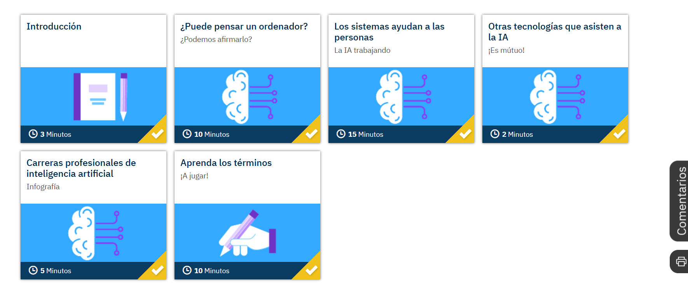

# Módulo Complemnetario – ¿Qué es la inteligencia artificial?

## Introducción  

En este módulo reflexiono sobre qué es realmente la **inteligencia artificial (IA)** y cómo ha evolucionado la idea de que las máquinas puedan llegar a “pensar”. Comprendí que la IA es una **rama de la ciencia que busca hacer que las máquinas sean inteligentes**, capaces de aprender, razonar y resolver problemas de manera similar a los humanos.  

Los avances recientes en informática han permitido que las máquinas aprendan a realizar tareas que antes creíamos exclusivas del pensamiento humano. Esto me lleva a cuestionarme: ¿puede una máquina realmente pensar? ¿O simplemente imita el comportamiento humano?  

Estas preguntas me acompañaron durante todo el módulo, ayudándome a entender que la IA no se trata solo de tecnología, sino también de **cómo definimos la inteligencia misma**.

---

## Un poco de historia  

Me sorprendió descubrir que la idea de una máquina pensante no es nueva. Desde hace siglos, los humanos han imaginado artefactos capaces de comportarse como personas:  

- En la antigua Grecia, el dios **Hefesto** construía máquinas doradas para que trabajaran para él.  
- En 1920, el escritor checo **Karel Čapek** creó el término “robot” para describir a seres mecánicos con pensamiento propio.  
- En 1950, **Alan Turing** formuló una pregunta que marcaría la historia: *“¿Pueden las máquinas pensar?”*  

Turing propuso un método para evaluar esto, conocido como **la Prueba de Turing**. Según él, si una máquina puede mantener una conversación con una persona y esta no logra distinguir si habla con un humano o con una máquina, entonces podríamos decir que la máquina “piensa”.

Años más tarde, en **1956**, en el Dartmouth College, nació oficialmente el campo de la **inteligencia artificial moderna**, cuando un grupo de científicos predijo que una máquina tan inteligente como una persona podría crearse en una generación. Aunque se equivocaron en el tiempo, su visión guió el desarrollo de la IA que hoy conocemos.

---

## La prueba de Turing  

Aprendí que la prueba de Turing también se conoce como el **“juego de imitación”**, donde un interrogador se comunica mediante texto con una máquina y una persona sin saber quién es quién.  
Si el interrogador no logra distinguirlos, se considera que la máquina ha demostrado un comportamiento inteligente.  

Esta prueba sigue siendo hoy una referencia esencial en el campo de la IA, pues plantea una cuestión fundamental: **¿qué significa realmente pensar?**

---

## Inteligencia humana vs inteligencia artificial  

Para hablar de inteligencia artificial, primero debo entender qué es la **inteligencia humana**.  
Esta se define como la capacidad de **razonar, aprender, resolver problemas, planificar y adaptarse**.  
Los humanos podemos usar experiencias pasadas, memoria, lenguaje y percepción para adaptarnos a nuevas situaciones y modificar nuestro entorno.  

La **IA**, en cambio, imita algunas de estas habilidades mediante algoritmos y procesamiento de datos. Aunque puede analizar y predecir información más rápido que una persona, no significa que posea consciencia o emociones.  
En otras palabras, **la IA razona, pero no siente**.

---

## Tipos de inteligencia artificial  

Durante el módulo aprendí que existen **tres niveles principales de IA**, cada uno con un propósito distinto:  

### 🔹 IA débil  
También conocida como **IA estrecha**, está diseñada para realizar tareas específicas, como los asistentes virtuales, los filtros de spam o los sistemas de recomendación.  
No tiene consciencia ni entendimiento real, solo sigue patrones y datos.  

### 🔹 Inteligencia aumentada  
En este tipo de IA, la tecnología **colabora con las personas** para potenciar sus capacidades.  
Un ejemplo son las herramientas que ayudan a los médicos a detectar enfermedades o los sistemas que optimizan procesos empresariales.  

### 🔹 IA general  
Este nivel busca crear máquinas capaces de **razonar, aprender y adaptarse como un ser humano**.  
Todavía no existe, pero es el objetivo más ambicioso de la investigación en inteligencia artificial.

---

## El papel de otras tecnologías en la IA  

También entendí que la IA no avanza sola. Su desarrollo se potencia con tecnologías como:  

- **El reconocimiento visual**, que permite a las máquinas interpretar imágenes.  
- **El procesamiento de lenguaje natural (PLN)**, que ayuda a entender y generar lenguaje humano.  
- **El análisis predictivo**, que permite anticipar comportamientos o resultados.  
- **La Internet de las Cosas (IoT)**, que conecta dispositivos inteligentes y genera grandes volúmenes de datos para entrenar modelos de IA.  

Gracias a estas tecnologías, hoy la IA se aplica en medicina, seguridad, atención al cliente, transporte y muchas otras áreas que antes parecían imposibles.

---

## Glosario de términos clave  

Durante el módulo también conocí los términos fundamentales del mundo de la IA:  

- **Algoritmo:** Conjunto de instrucciones que una máquina sigue para resolver un problema.  
- **Chatbot:** Programa que conversa con humanos mediante texto o voz.  
- **Datos:** Materia prima de la IA; la calidad de los datos determina la eficacia del modelo.  
- **Aprendizaje automático (Machine Learning):** Técnica que permite a las máquinas aprender de los datos sin ser programadas explícitamente.  
- **Aprendizaje profundo (Deep Learning):** Subcampo del aprendizaje automático basado en redes neuronales.  
- **Procesamiento del lenguaje natural (PLN):** Rama que enseña a las máquinas a comprender el lenguaje humano.  
- **Redes neuronales:** Modelos inspirados en el cerebro humano que permiten el aprendizaje profundo.  
- **Aprendizaje de refuerzo:** Método donde un agente aprende a tomar decisiones recibiendo recompensas o castigos.  
- **Aprendizaje supervisado y no supervisado:** Métodos para entrenar modelos con o sin etiquetas de datos.  
- **Reconocimiento visual y de voz:** Tecnologías que permiten a las máquinas identificar imágenes, objetos y palabras habladas.  

---

## Conclusión  

Este módulo me permitió comprender que la **inteligencia artificial no busca reemplazar la inteligencia humana**, sino **ampliarla**.  
Las máquinas pueden procesar información con una precisión y velocidad extraordinarias, pero somos los humanos quienes les damos propósito, ética y dirección.  

La IA es una herramienta poderosa que ya forma parte de nuestra vida cotidiana y seguirá transformando el futuro. Entender cómo funciona y hacia dónde se dirige me permite prepararme mejor para los desafíos y oportunidades del mundo digital.
