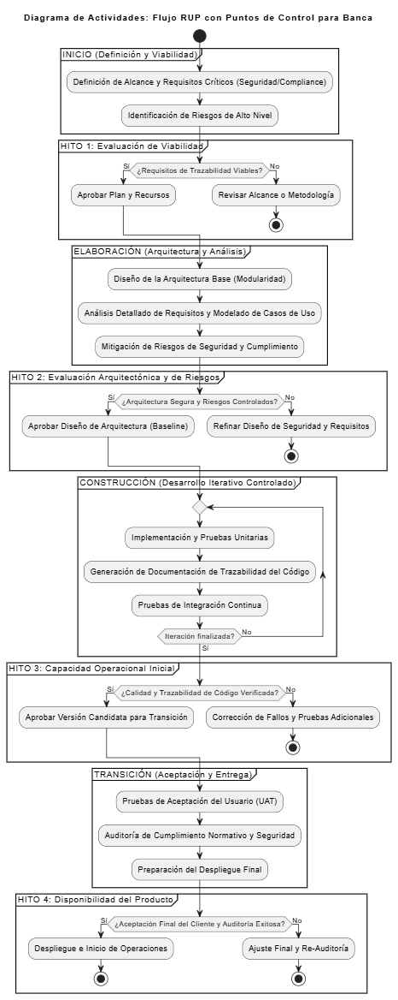

# SEGUNDA PREGUNTA - Foro: ¿Qué ventajas podría ofrecer RUP en este contexto, considerando los requerimientos de trazabilidad y control?

## Introducción 
En el desarrollo de sistemas bancarios, los requerimientos de seguridad, trazabilidad y control son fundamentales, ya que cada transacción debe ser verificable, cada modificación debe dejar un registro y todo el proceso debe estar documentado para cumplir con auditorías internas y externas. En este tipo de entornos, no es suficiente ni primordial entregar resultados rápidos; se requiere un enfoque estructurado que asegure calidad y confiabilidad. Por este motivo, la metodología RUP (Rational Unified Process) resulta especialmente **necesaria**, ya que está diseñada para proyectos donde la precisión y la trazabilidad son críticas.

## Escenario base

Un sistema bancario es una plataforma tecnológica que permite a los bancos realizar operaciones como transferencias, pagos, consultas de saldo y administración de cuentas. Para funcionar correctamente, debe ser seguro, confiable, estar siempre disponible y proteger la información de los clientes, además de cumplir con las normas legales y someterse a auditorías periódicas. Cualquier fallo puede generar pérdidas económicas o dañar la reputación de la entidad, por lo que su desarrollo requiere una metodología que garantice control, trazabilidad, planificación detallada y documentación en cada etapa.

## Pregunta 2

¿Qué ventajas podría ofrecer RUP en este contexto, considerando los requerimientos de trazabilidad y control?

Desde mi punto de vista, RUP ofrece varias ventajas clave para el desarrollo de un sistema bancario, especialmente **porque** este tipo de proyectos necesita un control estricto y un registro claro de todo lo que se hace.

Entre las principales ventajas que encontré están:

1. Control y seguimiento constante:
RUP permite tener un control completo en cada fase del desarrollo, registrando qué se hizo, quién lo hizo y cuándo se hizo. Esto facilita detectar errores y mantener una trazabilidad total, lo cual es vital para cumplir las normativas financieras.

2. Documentación detallada:
Cada paso queda documentado, lo que garantiza que todo el equipo tenga la misma información y se cumplan los requisitos legales y de auditoría del sector financiero, reduciendo riesgos de inconsistencias o pérdidas de información.

3. Identificación temprana de riesgos:
Desde las primeras fases se analizan los posibles problemas, lo que ayuda a tomar decisiones seguras y a evitar fallos graves en el sistema.

4. Calidad y estabilidad del software:
Al ser un proceso bien estructurado, las pruebas se hacen continuamente y cada versión del sistema pasa por controles de calidad antes de avanzar.

5. Cumplimiento normativo:
La trazabilidad y la documentación que exige RUP permiten demostrar ante entidades de control que el software cumple con los estándares financieros y de seguridad exigidos.

6. Facilidad para auditar:
Gracias al registro detallado de cada cambio o decisión, los auditores pueden revisar fácilmente cómo y por qué se tomó cada acción dentro del proyecto.

En conclusión, RUP es la metodología más adecuada para sistemas bancarios porque combina la estructura formal de un proceso tradicional con la posibilidad de realizar iteraciones controladas, garantizando así la trazabilidad, el control, la calidad y la estabilidad del software bancario.

## Diagrama UML
Para demostrar las ventajas de trazabilidad y control que RUP ofrece en un sistema bancario, se utiliza el Diagrama UML de Actividades porque este diagrama ilustra cómo el desarrollo no avanza hasta que se cumplen ciertos hitos formales o puntos de control, asegurando que los requisitos de seguridad, arquitectura y documentación se validen antes de pasar a la siguiente fase.

El flujo de RUP se divide en cuatro fases principales, y en cada una se inserta Punto de Control representado en el diagrama como una "partición" que contiene una decisión:

## INICIO:
En esta fase se definen los objetivos y requisitos del proyecto. Culmina con el Hito 1: Evaluación de Viabilidad, donde el equipo verifica que los aspectos de seguridad y cumplimiento sean posibles antes de avanzar. Esto permite identificar riesgos desde el principio, evitando problemas en etapas posteriores.

## ELABORACIÓN: 
Esta es la etapa más importante en términos de seguridad porque aquí se diseña la Arquitectura Base y se analizan los riesgos. El Hito 2: Evaluación Arquitectónica y de Riesgos asegura que los especialistas aprueben el diseño antes de continuar, garantizando la calidad y estabilidad del sistema.

## CONSTRUCCIÓN: 
Se desarrolla el software en iteraciones para mantener flexibilidad, pero al llegar al Hito 3: Capacidad Operacional Inicial, se revisa la trazabilidad del código y la documentación. Si algo no cumple los estándares, se corrige antes de avanzar, asegurando control y seguimiento constante.

## TRANSICIÓN: 
Es la fase final del proyecto. El Hito 4: Disponibilidad del Producto incluye pruebas de aceptación y una auditoría de cumplimiento. Solo si esta auditoría es exitosa, el sistema se despliega, garantizando facilidad para auditar y cumplimiento normativo.

En resumen, el diagrama de actividades demuestra que RUP "fuerza" el control. A diferencia de otras metodologías, los Hitos garantizan que la trazabilidad y la documentación no son opcionales, sino requisitos obligatorios para la continuidad del proyecto.

## Bibliografia 

Kassim, M., & Sulaiman Norakmar, A. (2010). An Approach Using RUP Test Discipline Process for Shared Banking Services (SBS) System. In Second International Conference on Computer Research and Development. IEEE. https://doi.org/10.1109/ICCRD.2010.138 https://www.academia.edu/731286/An_Approach_Using_RUP_Test_Discipline_Process_for_Shared_Banking_Services_SBS_System?utm_source 

Saqib, S. M., Ahmad, S., Hussain, S., Ahmad, B., & Bano, A. (2010). Improvement in RUP Project Management via Service Monitoring: Best Practice of SOA. arXiv https://arxiv.org/abs/1002.3996?utm_source