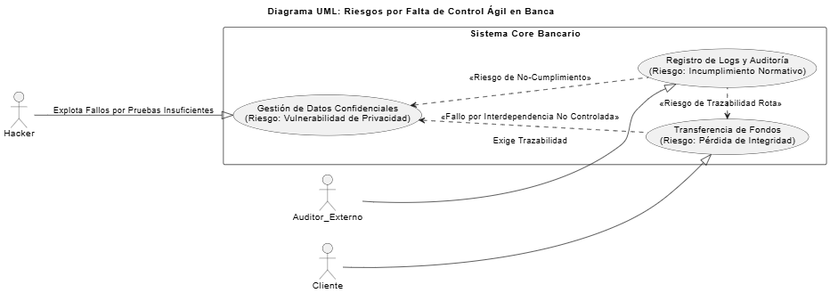

# TERCERA PREGUNTA - Foro: ¿Qué metodología usarías en un sistema bancario?

## Introducción

En el desarrollo de un sistema bancario, la elección de una metodología no solo influye en el tiempo de entrega, sino también en la seguridad y estabilidad del sistema. Estos proyectos manejan información financiera y confidencial, por lo que cualquier error puede tener consecuencias y daños graves tanto para el banco como para los clientes. Por esta razón, no es suficiente con usar una metodología moderna o popular, sino que debe ser la más adecuada para garantizar trazabilidad, control y cumplimiento de normas.

Muchas veces se eligen metodologías ágiles buscando rapidez o flexibilidad por ejemplo SCRUM ya que esta metodología es agíl y adecuada en muchos casos, pero para un sistema bancario no es suficiente, en este caso si no se adaptan correctamente al entorno bancario, pueden surgir riesgos importantes que afecten la calidad y la confiabilidad del software.

## Escenario base

Un sistema bancario es una plataforma tecnológica que permite a los bancos realizar operaciones como transferencias, pagos, consultas de saldo y administración de cuentas. Para funcionar correctamente, debe ser seguro, confiable, estar siempre disponible y proteger la información de los clientes, además de cumplir con las normas legales y someterse a auditorías periódicas. Cualquier fallo puede generar pérdidas económicas o dañar la reputación de la entidad, por lo que su desarrollo requiere una metodología que garantice control, trazabilidad, planificación detallada y documentación en cada etapa.

## Pregunta 3

¿Qué riesgos podrían surgir si se elige una metodología ágil sin adaptarla al entorno bancario?

Desde mi punto de vista, si se usa una metodología ágil sin hacerle ajustes al entorno bancario, podrían presentarse varios riesgos graves. Hay que tener en cuenta que en primer lugar, las metodologías ágiles buscan avanzar rápido y adaptarse al cambio, pero eso puede hacer que se pierda el control o la trazabilidad de las decisiones tomadas. En un banco, cada acción debe estar registrada y verificada, y si alguna de estas cosas no se cumplen podría haber fallos en las transacciones o errores en la información de los clientes.

Otro riesgo importante es la falta de documentación. Las metodologías ágiles suelen priorizar el desarrollo más que los informes, pero en el sector financiero es obligatorio tener evidencia de cada paso del proceso. Sin esa documentación clara y detallada, el proyecto podría fallar en auditorías o no cumplir con normas legales, generando un grave Riesgo de Incumplimiento Normativo (Compliance).

También si se usa una metodología no correcta esta el riesgo de que los equipos de trabajo prioricen la entrega rápida de nuevas funciones sin probarlas lo suficiente, lo que puede generar fallos técnicos o vulnerabilidades de seguridad. En un sistema bancario, incluso un pequeño error puede tener consecuencias económicas y de reputación, por eso en estos sistemas es fundamental probar y rectificar cada paso antes de seguir al siguiente y muchas metodologías agiles no hacen esto.

En conclusión, el riesgo principal es la falta de preparación y adaptación: Por eso, considero que si se quiere usar una metodología ágil en este tipo de entorno, debe hacerse de manera adaptada, combinándola con prácticas de control, documentación y validación, para que la rapidez no sacrifique la seguridad ni la calidad del sistema.

## Diagrama UML

Para ilustrar de manera concreta los peligros de usar una metodología ágil sin adaptarla al sector bancario, he creado un Diagrama UML de Casos de Uso enfocado en los riesgos. Este diagrama muestra que, cuando se prioriza la velocidad sobre el control, los fallos metodológicos se convierten en vulnerabilidades reales que afectan el dinero y la confianza del cliente.

El diagrama se centra en tres actores y tres casos de uso críticos, que son donde se manifiestan los riesgos que identifiqué en mi respuesta

1. Riesgo de Pérdida de Control y Trazabilidad - Caso de Uso: Transferencia de Fondos

Actor Afectado: Cliente.

La metodología ágil pura, al minimizar la documentación y el control estricto, crea el riesgo de "Pérdida de Integridad" durante las transacciones. Esto ocurre cuando la trazabilidad de los datos se rompe y un fallo en un módulo afecta a otro.

2. Riesgo de Seguridad y Vulnerabilidad - Caso de Uso: Gestión de Datos Confidenciales

Actor de Riesgo: Hacker.

Si el desarrollo es demasiado rápido, no hay tiempo para pruebas de seguridad rigurosas. El diagrama muestra que el Hacker puede "Explotar Fallos por Pruebas Insuficientes", comprometiendo la privacidad de los datos de los clientes.

3. Riesgo de Incumplimiento Normativo (Compliance) - Caso de Uso: Registro de Logs y Auditoría

Actor de Control: Auditor Externo.

La falta de documentación clara y detallada se traduce directamente en un "Riesgo de Incumplimiento Normativo". Si el sistema no puede demostrar cómo y por qué se realizó una acción, el proyecto no cumple con la ley.

En conclusión, este diagrama visualiza que la metodología es el primer control de riesgo. Si elegimos una metodología que ignora los requisitos de auditoría y trazabilidad, estamos exponiendo intencionalmente estos tres casos de uso críticos a un fallo sistémico.

## Bibliografía
Aguilar, V., & Villalba, M. (2018). Agile Effects on Risk Management in the Financial Industry. Digital Commons at Harrisburg University. https://digitalcommons.harrisburgu.edu/cgi/viewcontent.cgi?article=1070&context=dandt

Organization of American States (OAS). (2018). Estado de la Ciberseguridad en el Sector Bancario en América Latina y el Caribe. Secretaría de Seguridad Multidimensional. https://www.oas.org/es/sms/cicte/sectorbancariospa.pdf

Pineda, J. J. (2019). Lineamientos para entender la importancia del riesgo legal y su tratamiento, en el sistema financiero colombiano [Trabajo de grado]. Repositorio Institucional EAFIT. https://repository.eafit.edu.co/server/api/core/bitstreams/ae1499b6-5c64-44ef-ae67-95a8a5fa58fd/content