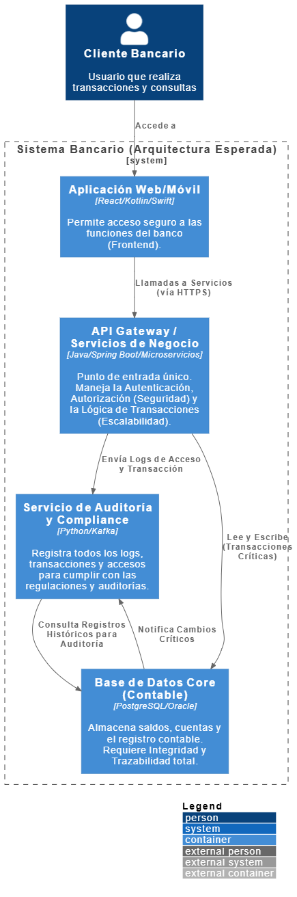

# CUARTA PREGUNTA - Foro: En términos arquitectónicos, ¿qué se esperaría de una metodología aplicada a sistemas financieros?

## Introducción

En el desarrollo de sistemas financieros, la arquitectura del software cumple un papel esencial, ya que define cómo se organizan, comunican y protegen los diferentes componentes del sistema. No solo es crear una aplicación funcional, sino de construir una estructura sólida que garantice la seguridad, la disponibilidad y la integridad de los datos. Por esta razón, la metodología de desarrollo que se elija debe asegurar que cada decisión técnica esté respaldada por una planificación clara y controles constantes. En este tipo de proyectos, la arquitectura es la base que sostiene el sistema bancario.

## Escenario base

Un sistema bancario es una plataforma tecnológica que permite a los bancos realizar operaciones como transferencias, pagos, consultas de saldo y administración de cuentas. Para funcionar correctamente, debe ser seguro, confiable, estar siempre disponible y proteger la información de los clientes, además de cumplir con las normas legales y someterse a auditorías periódicas. Cualquier fallo puede generar pérdidas económicas o dañar la reputación de la entidad, por lo que su desarrollo requiere una metodología que garantice control, trazabilidad, planificación detallada y documentación en cada etapa.

## Pregunta 4

En términos arquitectónicos, ¿qué se esperaría de una metodología aplicada a sistemas financieros?

Desde mi punto de vista, una metodología aplicada a sistemas financieros debe garantizar una arquitectura estable, segura y flexible. En este tipo de sistemas, cada módulo como cuentas, usuarios, transacciones o reportes debe estar bien definido y conectado de forma confiable, evitando fallos o inconsistencias.

Lo primero que se espera es seguridad, ya que el sistema maneja datos confidenciales y dinero. La metodología debe contemplar mecanismos que permitan verificar quién accede, qué cambios realiza y cómo se almacenan los datos.

También se espera escalabilidad, es decir, que el sistema pueda crecer sin perder rendimiento. Los bancos suelen ampliar sus servicios y necesitan una arquitectura capaz de adaptarse a nuevas funciones sin afectar las ya existentes.

Otro punto clave es la modularidad, que consiste en dividir el sistema en partes independientes para facilitar el mantenimiento y las pruebas. Así, si se presenta un fallo en un módulo, no se afecta todo el sistema.

Por último, la metodología debe promover documentación técnica clara, lo que ayuda a comprender la estructura general del sistema y facilita futuras actualizaciones o auditorías.

En conclusión, desde una perspectiva arquitectónica, la metodología debe garantizar que el sistema financiero sea seguro, estable, escalable y mantenible, combinando control y flexibilidad para responder a las exigencias del sector bancario sin comprometer la confianza ni la calidad.

## Diagrma C4 -  Contexto

El diagrama C4 Nivel 2 (Contenedores) es la mejor herramienta para justificar mis expectativas arquitectónicas, ya que muestra visualmente cómo la metodología debe forzar la separación de las partes del sistema.

Este diagrama ilustra directamente los tres pilares de mi respuesta: Modularidad, Seguridad y Escalabilidad.

### Modularidad y Mantenimiento:

* El diagrama separa claramente la Aplicación Web/Móvil de la Lógica de Negocio. Esto demuestra la modularidad que mencioné ya que si tengo que actualizar el diseño del móvil, no toco el núcleo del sistema, facilitando el mantenimiento y las pruebas.

### Seguridad y Control (API Gateway y Compliance):

* API Gateway: Funciona como una puerta de entrada que controla todo el tráfico del sistema. Aquí se aplican los mecanismos de seguridad para verificar quién entra y qué acciones realiza. De esta forma, se mantiene un control total de accesos y un registro completo de las operaciones.

* Servicio de Auditoría y Compliance: Es un módulo independiente que se encarga de los registros y la documentación de auditoría. Al estar separado del código principal, se asegura la integridad de los datos y una documentación técnica clara y confiable.

### Estabilidad y Escalabilidad (Separación del Core):

* La Base de Datos Core (Contable) se mantiene completamente aislada para proteger la información más crítica. Solo el API Gateway puede conectarse directamente a ella para realizar transacciones seguras. Gracias a esta arquitectura en capas, el sistema mantiene su estabilidad y permite que los demás módulos se replican o escalen sin poner en riesgo el núcleo contable.

En conclusión, este Diagrama de Contenedores no es solo un dibujo es el plano que la metodología elegida (como RUP) debe garantizar que se construya. Sin esta estructura clara y modular, no podríamos asegurar la seguridad ni la escalabilidad necesarias para un sistema financiero.

## Bibliografía
Convotis. (2024). Arquitectura TI: más flexibilidad con modularidad y la escalabilidad. https://www.convotis.com/es/news/crecimiento-sin-limites-como-las-arquitecturas-de-ti-modulares-hacen-escalable-tu-negocio/

Saccsa Software. (2025). Arquitectura de un Core Bancario: Estructura, Componentes y Funcionalidad. https://saccsa.com.mx/blog/arquitectura-de-un-core-bancario-estructura-componentes-y-funcionalidad/

Serban Group. (2025). 5 estrategias IT para cumplir con las regulaciones bancarias. https://serbangroup.com/blog/estrategias-it-cumplir-regulaciones-bancarias