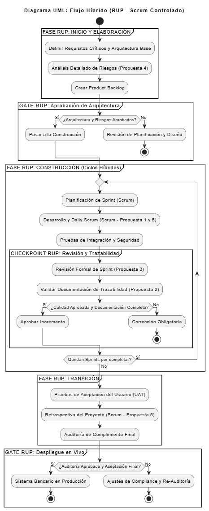

# QUINTA PREGUNTA - Foro: Si estuvieras liderando el proyecto, ¿qué enfoque metodológico adoptarías y cómo lo justificarías ante tu equipo?

## Introducción

Liderar el desarrollo de un sistema bancario implica tomar decisiones que garanticen la funcionalidad del software, y también su seguridad, estabilidad y cumplimiento con las normas financieras. El enfoque metodológico que se elija es el que definirá cómo se organiza el trabajo, también cómo se comunican los avances y qué tanto control se tiene sobre el proceso. En un entorno tan exigente como el bancario, el liderazgo no solo consiste en dirigir sino en guiar al equipo hacia un resultado confiable y de calidad.

## Escenario base

Un sistema bancario es una plataforma tecnológica que permite a los bancos realizar operaciones como transferencias, pagos, consultas de saldo y administración de cuentas. Para funcionar correctamente, debe ser seguro, confiable, estar siempre disponible y proteger la información de los clientes, además de cumplir con las normas legales y someterse a auditorías periódicas. Cualquier fallo puede generar pérdidas económicas o dañar la reputación de la entidad, por lo que su desarrollo requiere una metodología que garantice control, trazabilidad, planificación detallada y documentación en cada etapa.

## Pregunta 5

Si estuvieras liderando el proyecto, ¿qué enfoque metodológico adoptarías y cómo lo justificarías ante tu equipo?

Si yo fuera la líder del proyecto de desarrollo de un sistema bancario, adoptaría un enfoque híbrido, combinando la metodología RUP con prácticas de Scrum, porque considero que este tipo de sistemas necesita tanto control y trazabilidad como flexibilidad para adaptarse a los cambios.

Y para eso haría cinco propuestas concretas que aplicaría y se las justificaría a mi equipo:

### 1. Planificación estructurada (RUP) con reuniones cortas (Scrum)

Le explicaría al equipo que la planificación inicial debe ser muy detallada, como lo propone RUP, para evitar errores en el futuro. Sin embargo, implementaría reuniones diarias cortas, al estilo Scrum, para mantener la comunicación constante, resolver obstáculos y avanzar de forma coordinada.

### 2. Documentación completa pero práctica

Adoptaría la rigurosidad de RUP para dejar evidencia de cada decisión, pero sin sobrecargar al equipo con papeleo innecesario. Usaríamos plantillas simples y claras que permitan registrar los avances sin restar tiempo al desarrollo. Así se cumple con los requisitos de auditoría sin perder agilidad.

### 3. Iteraciones controladas

Dividiría el proyecto en fases o entregas pequeñas (como los sprints), pero cada una pasaría por revisiones formales antes de avanzar a la siguiente etapa. Esto combina la flexibilidad de Scrum con la trazabilidad y control de RUP, asegurando calidad en cada entrega.

### 4. Gestión de riesgos constante

Propondría que en cada iteración se identifiquen y analicen los posibles riesgos técnicos o de seguridad. Esto ayuda a anticipar problemas y evita que un error pequeño se convierta en una falla grave en el sistema bancario.

### 5. Cultura de colaboración y mejora continua

Fomentaría un ambiente donde todos los miembros del equipo puedan aportar ideas y sugerencias, aunque el proceso siga siendo estructurado. Así, se mantiene la disciplina del trabajo planificado, pero también se promueve la innovación y el compromiso.

En conclusión, adoptaría un enfoque híbrido RUP–Scrum, porque me permite equilibrar lo mejor de ambos mundos que sería el control, la trazabilidad y la calidad del proceso formal de RUP, junto con la comunicación, la adaptabilidad y la mejora continua de Scrum. Este equilibrio garantizaría un sistema bancario confiable, seguro y adaptable a los retos del entorno financiero.

## Diagramas 

Para justificar ante mi equipo el enfoque híbrido RUP-Scrum, usaría dos diagramas clave. Primero, el C4 - contexto para establecer la seriedad del proyecto o sea el por qué necesitamos control y luego el UML de Actividades para mostrarles el nuevo flujo de trabajo que equilibra la agilidad con la disciplina que seria el cómo vamos a trabajar.

* ### C4 - contexto: El "Por Qué" 
Utilizaré el Diagrama C4 - contexto para recordarle al equipo la naturaleza crítica del proyecto.

Esto lo haría para demostrarles que el sistema bancario no es un software cualquiera lo que hace el dl diagrama es que muestra que nuestro Core Bancario interactúa directamente con el Cliente, la Red de Pagos y fundamentalmente, los Reguladores/Auditores.

Este enfoque visual muestra por qué la planificación detallada y la documentación formal son esenciales. No se trata de una preferencia del equipo, sino de una exigencia del regulador, lo que justifica el uso de RUP en las fases iniciales y finales del proyecto.

* ### B. UML de Actividades: El "Cómo"
El Diagrama UML de Actividades es la herramienta clave para explicar cómo trabajaremos bajo el enfoque híbrido. Este flujo operacional valida las primeras tres de mis cinco propuestas ante el equipo:

### Planificación estructurada y reuniones cortas: 
El diagrama inicia con la fase de INICIO de RUP, donde se hace la planificación a fondo. Luego, en la fase de CONSTRUCCIÓN, se integran Sprints de Scrum, manteniendo la comunicación constante y la capacidad de adaptación.

### Iteraciones controladas y trazabilidad: 
Cada Sprint termina con un punto de control (GATE RUP). Solo si el producto cumple con los estándares de calidad y trazabilidad, se puede avanzar. Así se logra un equilibrio entre la agilidad de Scrum y el control de RUP.

### Documentación práctica: 
La documentación no se deja para el final. Se actualiza en cada punto de control, de forma práctica y breve, manteniendo la rigurosidad sin burocracia, para que el proceso sea más ágil pero igual de sólido.

En conclusión usamos el C4 para entender la presión externa y el UML para implementar un flujo de trabajo disciplinado y ágil que nos permitirá entregar un sistema seguro sin sacrificar nuestra capacidad de respuesta. Este equilibrio garantiza el control (RUP) y la colaboración (Scrum).

## Bibliografía

Fernández, J. M., & Cadelli, S. (2014). Convivencia de metodologías: Scrum y RUP en un proyecto de gran escala [Tesis de grado, Universidad Nacional de La Plata]. Repositorio SEDICI. https://sedici.unlp.edu.ar/handle/10915/47082

Kazman, R., Kruchten, P., Nord, R., & Tomayko, J. E. (2004). Integrating software-architecture-centric methods into the Rational Unified Process. CMU/SEI Technical Report CMU/SEI-2004-TR-011. Software Engineering Institute. https://doi.org/10.1184/R1/6574586.v1

Letelay, K., Mola, S. A. S., & Go, R. (2023). Challenges of agile software development in the banking sector: A systematic literature review. JOIV: International Journal on Informatics Visualization, 9(1). https://doi.org/10.62527/joiv.9.1.2300

Schwaber, K., & Sutherland, J. (2020). La Guía Scrum (traducida al español). Scrum.org. https://agilenomadlife.com/wp-content/uploads/2021/07/Guia-Scrum-ORG-2020-Espanol.pdf